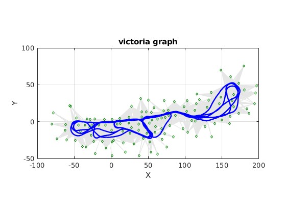

This repo contains matlab code for Graph SLAM experiments on matlab.

## Victoria Dataset

In the Victoria Park SLAM folder, an implementation of a graph based SLAM using the MATLAB pose2d API is proposed.
From this, two alternative datasets are proposed with data association using ids to make experiments easy on this dataset.

`VictoriaDatasetrthetalmk.txt` is for range and bearing factors and is organized as follow:

` measurement id, odometry, dx, dy, dtheta, I(1,1) , I(2,2), I(3,3)`

` measurement id, landmark, id, range, bearing, I(1,1) , I(2,2)`

`VictoriaDatasetxylmk.txt` is for relative x-y pose factors (adapted to MATLAB API) and is organized as follow:

` measurement id, odometry, dx, dy, dtheta, I(1,1) , I(2,2), I(3,3)`

` measurement id, landmark, id, dx, dy, I(1,1) , I(2,2)`

`.mat` files are also available to load them easily with matlab. A simple example graph optimization with this dataset is 
provided in `datasetWrapper.mat`.
The dataset represents the following graph after optimization:

                         
## Marginalization & sparsification 

The other files implement simple applications of node marginalization and factor recovery as described in 
*Nonlinear Factor Recovery for Long-Term SLAM* by Mazuran et al

